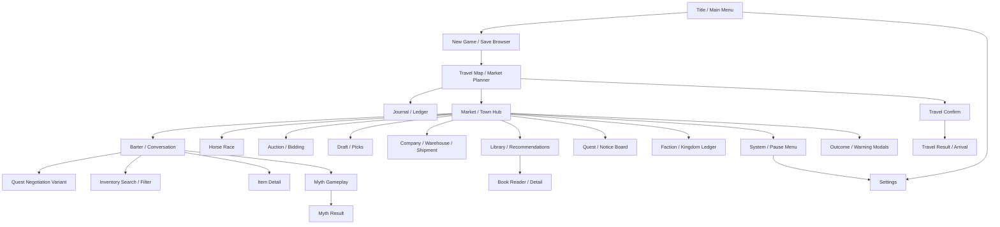

# Game UI Pages And UX Brief

Use this file as the UI/UX source brief for designing the Merchant React/Electron remake. It is written for an AI designer, mockup generator, or implementer: each screen includes purpose, access path, required UI elements, layout notes, and the current visual target.

The target is an offline fantasy merchant game inspired by Merchant of the Six Kingdoms. Design the actual playable application screens using the current UI reference images in `docs/ui_parts/`.

## Global Product Direction

- Current visual target: bright illustrated fantasy trade UI with sunlit coastal towns, painterly world maps, polished character portraits, collectible item art, parchment ledgers, carved dark wood framing, blue enamel header plates, brass trim, heraldic seals, gold coin/status chips, and large game-like command buttons.
- The project look is ornate and premium, but still practical: screens should feel like a polished PC merchant RPG interface, with clear trading, travel, inventory, and dialogue workflows.
- Prioritize scanning, comparison, and repeated action without flattening the UI into a plain productivity dashboard.
- Preserve strong visual separation between:
  - player inventory
  - NPC inventory
  - player offer
  - NPC offer
  - dialogue
  - route/travel state
  - quest/event state
- Use original-like flow: title/front-end -> map/market planner -> market/barter loop, with journal, settings, minigames, company, and event screens branching off.
- Text must be rendered by React, not baked into images. Generated mockups should leave clean readable areas for real UI text.
- Use the current reference mockups as the baseline for tone and proportions:
  - `docs/ui_parts/01-title-main-menu.png`
  - `docs/ui_parts/02-new-game-merchant-profile.png`
  - `docs/ui_parts/03-save-load-browser.png`
  - `docs/ui_parts/04-settings-options.png`
  - `docs/ui_parts/05-system-pause-menu.png`
  - `docs/ui_parts/06-travel-map-market-planner.png`
  - `docs/ui_parts/07-market-town-hub.png`
  - `docs/ui_parts/08-customer-npc-selection.png`
  - `docs/ui_parts/09-barter-conversation-main-screen.png`
  - `docs/ui_parts/10-inventory-management.png`
  - `docs/ui_parts/11-inventory-search-filter-popover.png`
  - `docs/ui_parts/12-item-detail-modal.png`

## Visual System Requirements

- Frame: dark carved wood outer shell with brass cornerwork and occasional black vignette behind modal overlays.
- Headers: blue enamel or dark lacquer title plates with gold serif labels and ornamental brass edges.
- Panels: parchment ledgers and scroll surfaces with subtle ink dividers, gold filigree, and enough empty space for React-rendered text.
- Buttons: beveled game command buttons in distinct colors: green for primary, blue for secondary/selected, red for dangerous, muted parchment/wood for neutral, and visibly desaturated disabled states.
- Icons: use `lucide-react` for app-rendered controls when suitable, but style them to sit inside the fantasy UI language; use heraldic or item art where the reference mockups use richer game icons.
- Inventory cells: parchment or dark slot tiles with gold borders, quantity badges, rarity stars, legality markers, quest markers, protect/star, conceal marker, and hover/selection states.
- Modals: large parchment overlays with brass frames, close buttons, dimmed game background, and clear action rows.
- Toasts: small parchment/brass notice badges that do not cover inventory or critical dialogue.
- Mobile is secondary, but layouts must still avoid overlap and preserve readable text on narrow screens.

## Navigation Model



## Screen Inventory

### 1. Title / Main Menu

Purpose: first screen on app launch.

Access path: app start, return from pause/menu.

Required UI:

- Game title.
- Continue button when a save exists.
- New Game.
- Load Game.
- Settings.
- Exit/Quit.
- Optional version text.
- Background art: bright harbor/city vista or trade table scene with the menu framed on one side, matching `01-title-main-menu.png`.

Layout notes:

- This is the game front door: illustrated, polished, and immediately playable.
- Keep buttons grouped as a clear vertical command stack.
- Title should be prominent, but leave a hint of interactive menu below the first viewport if adapting for small screens.

### 2. New Game / Merchant Profile

Purpose: create a new merchant save.

Access path: Main Menu -> New Game.

Required UI:

- Merchant name input.
- Starting market/hometown selector.
- Starting difficulty/economy preset.
- Hard Mode option if multiple-save/second-save rule is implemented.
- Starting inventory preview.
- Starting coins/wealth preview.
- Confirm and Back buttons.

Layout notes:

- Present as a ledger page or registration document.
- Use compact controls; do not turn it into a character-RPG creator unless gameplay needs it.

### 3. Save / Load Browser

Purpose: manage existing local saves.

Access path: Main Menu -> Load Game, Pause Menu -> Load/Save.

Required UI:

- Save slot list.
- Save name.
- Merchant name.
- Current city/market.
- In-game day.
- Coin/wealth summary.
- Last saved timestamp.
- Mode/difficulty badge.
- Load, overwrite, delete, export/import actions.
- Empty state.

Layout notes:

- Use a ledger/table design. Dense rows are better than decorative save cards.
- Delete and overwrite require confirmation modals.

### 4. Settings / Options

Purpose: configure audio, display, accessibility, and game toggles.

Access path: Main Menu, System/Pause Menu.

Required UI:

- Sliders: music, ambience, voices, UI sounds, item sounds.
- Text speed slider.
- UI scale.
- Fullscreen/windowed.
- Accessibility toggles.
- Theft enabled/disabled.
- Highlight uncollected or highlighted items toggle.
- Reset defaults.
- Apply/Back.

Layout notes:

- Use grouped sections rather than one long list.
- Keep toggles visually distinct from sliders.

### 5. System / Pause Menu

Purpose: quick in-game command layer.

Access path: bottom-right hover/menu button or keyboard.

Required UI:

- Resume.
- Save.
- Load.
- Settings.
- Main Menu.
- Quit.
- Optional compact status: location/day/save state.

Layout notes:

- Original evidence suggests a bottom-right hover menu affordance. For the remake, use a visible but unobtrusive corner button.
- This should overlay the current gameplay screen without losing context.

### 6. Travel Map / Market Planner

Purpose: choose destination, inspect markets, and plan routes.

Access path: after title/new save, after leaving market, after travel result.

Required UI:

- Large illustrated world map.
- City/market nodes.
- Route lines.
- Current location marker.
- Locked destination marker.
- Selected market panel.
- Kingdom/faction identity.
- Leader/religion/region summary if available.
- Legal/illegal item warnings for destination kingdom.
- Local demand/supply hints.
- Quest/event availability.
- Travel days, tolls, stallage, risk.
- Carry capacity warning.
- Buttons: Travel, Skip Day if implemented, Journal, Back/Enter Market.

Layout notes:

- Map should dominate the screen.
- Side panel should be compact and scannable.
- Locked nodes should explain requirements on hover/click.

### 7. Market / Town Hub

Purpose: main city screen after entering a market.

Access path: Travel Map -> Enter Market, Travel Result -> Continue.

Required UI:

- Town or market background art.
- Current city name.
- Current day/time.
- Player coins/wealth.
- Carry capacity summary.
- Active market event banner.
- Available customers/NPCs.
- Local services/actions:
  - Trade
  - Travel Map
  - Inventory
  - Journal
  - Notice Board
  - Company/Warehouse if available
  - Library if available
  - Auction/Horse Race/Myth event if active
- System menu button.

Layout notes:

- Hub should feel like a busy town square but remain functional.
- NPC and action lists should be easy to scan.

### 8. Customer / NPC Selection

Purpose: choose a person to talk or trade with.

Access path: Market Hub -> NPC/customer list.

Required UI:

- NPC portrait.
- Name.
- Profession.
- Location or affiliation.
- Trade style hint.
- Wealth/budget hint if known.
- Likes/dislikes preview.
- Inventory category preview.
- Quest/event marker.
- Talk/Trade button.
- Next Customer.

Layout notes:

- Can be integrated into the Market Hub or Trading screen, but design it as a reusable roster pattern.

### 9. Barter / Conversation Main Screen

Purpose: core trading loop.

Access path: choose NPC from Market Hub or Customer Selection.

Required UI:

- NPC portrait and name.
- NPC profession/status.
- Dialogue box and response choices.
- Scrollable dialogue history or current dialogue state.
- NPC stock panel.
- NPC offer panel.
- Player offer panel.
- Player inventory panel.
- Offer value comparison.
- Missing/excess value indicator.
- NPC mood/interest/trust.
- Likes/dislikes/preferences panel.
- Buttons:
  - Ask for Price
  - Ask for Offer
  - Make Offer / Propose Trade
  - Accept
  - Clear Offer
  - Goodbye
  - Next Customer
- Help/tip button.

Layout notes:

- Recommended desktop layout: NPC inventory left, dialogue/offer status center, player inventory right.
- Inventory and offers must stay visually separate.
- Make room for response buttons that vary by dialogue/quest state.

### 10. Quest Negotiation / Special Deal Variant

Purpose: dialogue state for structured quest contracts and special bargains.

Access path: NPC dialogue when a quest/story offer is active.

Required UI:

- NPC portrait.
- Special offer text.
- Quest objective preview.
- Reward/cost preview.
- Required item or destination.
- Time limit if any.
- Branching response buttons, for example:
  - Deal
  - Ask for more reward
  - Ask for advance payment
  - Refuse
  - Barter
  - Goodbye

Layout notes:

- Use the same base shell as Barter, but emphasize the contract terms.
- Response buttons may be more important than inventory on this variant.

### 11. Inventory Management

Purpose: inspect and manage player goods outside an active trade.

Access path: Market Hub, Travel Map, Barter screen shortcut.

Required UI:

- Inventory grid with variable item sizes.
- Quantity badges.
- Item icon.
- Value.
- Weight and size.
- Total carried weight/size/capacity.
- Search/filter.
- Sort controls.
- Category filters.
- Protected/starred marker.
- Concealed marker.
- Illegal marker.
- Quest item marker.
- Highlighted item marker.
- Bulk actions.
- Item details side panel or modal trigger.

Layout notes:

- This is a high-frequency utility screen. Favor compact, legible parchment tiles and a strong right-side inspector over oversized decorative cards.

### 12. Inventory Search / Filter Popover

Purpose: fast inventory filtering while trading or managing inventory.

Access path: search/filter button near size/weight or inventory toolbar.

Required UI:

- Search input with auto-focus.
- Name/tag search.
- Category toggles.
- Clear search.
- Result count.

Layout notes:

- This can be a compact popover, not a full page.
- It must not cover the item list more than necessary.

### 13. Item Detail Modal

Purpose: inspect exact item mechanics and actions.

Access path: click/right-click/inspect item from any inventory.

Required UI:

- Large item icon.
- Name.
- Quantity.
- Tags/categories.
- Base value and known market demand hints.
- Weight and size.
- Rarity/unique/quest flags.
- Legal/illegal status in current kingdom.
- Concealed/protected status.
- Notes/highlight controls.
- Actions:
  - Add to offer
  - Protect/unprotect
  - Conceal/reveal
  - Read/use if applicable
  - Close

Layout notes:

- Small parchment modal or right-side inspector.
- Do not hide the currently selected inventory context.

### 14. Journal / Ledger

Purpose: track quests, item knowledge, notes, highlights, and travel/economy observations.

Access path: Travel Map, Market Hub, System Menu.

Required UI:

- Tabs:
  - Quests
  - Items
  - Markets
  - Notes
  - Rumors
- Active quest list.
- Completed quest list.
- Item notes editor.
- Highlighted items list.
- Market demand/supply notes.
- Search.
- Filters.

Layout notes:

- Design as a book/ledger, but keep it usable.
- Item notes and highlights are important because trading depends on memory and comparison.

### 15. Quest / Notice Board

Purpose: optional jobs, rumors, contracts, delivery tasks.

Access path: Market Hub -> Notice Board.

Required UI:

- Posted notices list.
- Job title.
- Destination.
- Required item/objective.
- Reward.
- Time limit.
- Risk.
- Accept/decline.
- Active/expired/completed state.

Layout notes:

- Wooden notice board or pinned parchment list.
- Do not bake readable text into generated background art.

### 16. Dialogue / Story Event Screen

Purpose: non-trade conversations, story events, rumors, and special scenes.

Access path: NPC dialogue, market events, quests.

Required UI:

- Character portrait or scene art.
- Speaker name.
- Dialogue text.
- Tone/mood indicator if useful.
- Response choices.
- Reward/cost preview where relevant.
- Continue/back/goodbye.

Layout notes:

- This can reuse the Barter dialogue shell when inventory is irrelevant.
- Some story events need modal-like decisions rather than full inventory.

### 17. Outcome / Consequence Modals

Purpose: show serious story, law, or quest consequences.

Access path: quest completion/failure, election, confiscation, exile, illegal goods, special events.

Required UI:

- Outcome title.
- Summary text.
- Items/currency gained or lost.
- Confiscated item list where applicable.
- Reputation/unlock changes.
- Choice buttons if the outcome branches:
  - accept exile
  - sneak back
  - resist
  - continue
- Close/continue.

Layout notes:

- This should feel weightier than a toast.
- Use clear item lists for losses/rewards.

### 18. Travel Confirmation Modal

Purpose: confirm route before spending time/money and risking consequences.

Access path: Travel Map -> Travel.

Required UI:

- From and destination.
- Travel days.
- Toll/cost breakdown.
- Stallage/market fees if applicable.
- Capacity status.
- Illegal goods warning.
- Theft/guard/risk warning.
- Confirm travel.
- Cancel.

Layout notes:

- Small modal over map.
- Make warnings obvious but not noisy.

### 19. Travel Result / Arrival Screen

Purpose: summarize trip and arrival.

Access path: after confirmed travel.

Required UI:

- Travel summary.
- Money spent.
- Days passed.
- Items stolen/confiscated/lost if any.
- Random encounter or event result.
- Arrival market name.
- Continue to Market.
- Return to Map.

Layout notes:

- Road/map background or parchment arrival notice.
- Use concise summary rows.

### 20. City / Market Detail

Purpose: inspect a market before or after travel.

Access path: map node, market hub info button.

Required UI:

- City/market name.
- Kingdom/faction banner.
- Locked/unlocked status.
- Available professions.
- Known NPCs.
- Local demand/supply.
- Common goods.
- Expensive/imported goods.
- Illegal item categories.
- Stallage/tolls.
- Routes from city.
- Active quests/events.

Layout notes:

- Can be a side panel on the map or full detail page.

### 21. Faction / Kingdom Ledger

Purpose: show kingdom/faction rules and relationships.

Access path: Journal, Market Detail, Market Hub.

Required UI:

- Kingdom/faction list.
- Flags/seals/coats of arms.
- Reputation/status.
- Illegal item tags.
- Active contracts.
- Benefits/penalties.
- Known market preferences.

Layout notes:

- Heraldry-led ledger.
- Make legal restrictions highly visible.

### 22. Company / Warehouse / Shipment

Purpose: manage company progress, shipments, stock, and warehouse systems.

Access path: Market Hub service, quest/story unlock.

Required UI:

- Company name/status.
- Your gold.
- Profit split.
- Stock owned.
- Warehouse status.
- Available shipment list.
- Shipment item grid.
- Collect Shipment button.
- Build/upgrade warehouse if available.
- Shipment history.

Layout notes:

- Operational ledger, not decorative hero.
- Item grid should share visual language with inventory.

### 23. Auction / Bidding

Purpose: bid on items during auction events.

Access path: Market event, auction NPC.

Required UI:

- Auctioneer portrait/name.
- Current lot/item.
- Item detail summary.
- Current bid.
- Player available money.
- Competing bidders.
- Bid button.
- Pass button.
- Result state: won/lost, item transfer, cost.
- Crowd reaction area.

Layout notes:

- Make current lot and current bid the focal points.
- Use compact bidder list and clear action buttons.

### 24. Draft / Picks

Purpose: handle draft-style event choices/picks.

Access path: special market event or story system.

Required UI:

- Pick order.
- Picks owned by player.
- Available choices/items.
- Selected pick detail.
- Confirm pick.
- Pass/trade pick if supported.
- Resolved picks list.

Layout notes:

- Treat as a specialized event screen, visually close to auction/company ledger.

### 25. Horse Race / Betting

Purpose: bet on or resolve horse-racing events.

Access path: Market event, racing NPC.

Required UI:

- Race title.
- Horse/runner list.
- Odds.
- Advice purchase option if available.
- Bet amount input.
- Place Bet.
- Start race.
- Race progress/result.
- Winnings/losses.

Layout notes:

- First usable version can be a betting board plus result panel.
- Do not overinvest in animated race UI until betting rules are stable.

### 26. Myth Gameplay

Purpose: play the Myth card minigame.

Access path: Myth NPC, market event, tournament.

Required UI:

- Player deck/hand.
- Opponent hand/board.
- Play area.
- Card details/effects.
- Score or round state.
- Turn indicator.
- Skip Turn.
- Forfeit.
- Wager/prize indicator if relevant.

Layout notes:

- Card readability matters more than decorative frame.
- Use a distinct but still medieval table-game feel.

### 27. Myth Result / Post-Match

Purpose: show Myth outcome and next actions.

Access path: after Myth match.

Required UI:

- Win/loss/draw result.
- Score comparison.
- Cards/rewards gained or lost.
- Tournament progress if applicable.
- Play Another.
- Leave.
- Quit/return where valid.

Layout notes:

- Compact result overlay on top of Myth board works well.

### 28. Library / Recommendations

Purpose: browse library content and recommendations.

Access path: library market service or NPC.

Required UI:

- Library title/location.
- Book/recommendation list.
- Recommendation button/action.
- Book categories.
- Selected book summary.
- Read/open.
- Exit.

Layout notes:

- Use bookcase/ledger styling, but keep recommendation and exit controls visible without scrolling too far.

### 29. Book Reader / Detail

Purpose: read book content or inspect collected books.

Access path: Library, readable item detail.

Required UI:

- Book title.
- Page/body text area.
- Page navigation if long.
- Notes/highlight action if useful.
- Back/Close.

Layout notes:

- Only build this if readable book text exists or can be authored.
- Prioritize typography and page margins.

### 30. Help / Controls Modal

Purpose: explain mouse/keyboard actions.

Access path: help button or system menu.

Required UI:

- Mouse actions:
  - left click
  - right click
  - drag if implemented
  - shift/alt modifiers
- Inventory actions:
  - move one
  - move all
  - move half
  - move ten
  - protect/star
  - conceal
- Trading actions.
- Map actions.
- Minigame actions if implemented.
- Close.

Layout notes:

- Readable modal; no tiny decorative text in generated artwork.

### 31. Confirmation / Warning Modals

Purpose: reusable confirmations for risky actions.

Access path: global.

Required UI:

- Save overwrite.
- Delete save.
- Quit without saving.
- Trade confirmation when offer is unusual.
- Travel with high cost or risk.
- Carrying illegal goods.
- Destroy/drop/sell protected item.
- Confirm/Cancel.

Layout notes:

- Create one reusable modal style.

### 32. Toast / Small Notification

Purpose: small feedback messages.

Access path: global event feedback.

Required UI:

- Item moved.
- Trade accepted/rejected.
- Save complete.
- Not enough money.
- Item protected/concealed.
- Route too expensive.
- Quest updated.
- Journal note saved.

Layout notes:

- Small, timed, non-blocking.
- Avoid covering critical offer/value indicators.

## Recommended UI/UX Design Order

1. Barter / Conversation Main Screen.
2. Inventory Management plus Item Detail.
3. Travel Map / Market Planner.
4. Market / Town Hub.
5. Journal / Ledger.
6. Main Menu, Save Browser, Settings, Pause Menu.
7. Quest Negotiation and Story Event screens.
8. Travel Confirmation and Arrival Result.
9. Company / Warehouse / Shipment.
10. Auction / Draft / Horse Race.
11. Myth Gameplay and Myth Result.
12. Library / Book Reader.
13. Reusable modals, toasts, help.

## AI Mockup Prompt Template

Use this template for each screen.

```text
Create a full-screen UI/UX mockup for an offline fantasy merchant trading game.

Screen: [SCREEN NAME]

Purpose:
[PASTE PURPOSE]

Required elements:
[PASTE REQUIRED UI LIST]

Style:
Bright painterly fantasy merchant UI matching the current `docs/ui_parts` references: sunlit coastal town and world-map artwork, parchment ledgers, carved dark wood shell, blue enamel header plates, brass trim, heraldic seals, gold status chips, polished NPC portraits, collectible item icons, and beveled green/blue/red command buttons.

Layout requirements:
- Compact but organized information hierarchy.
- Clear interactive controls and disabled states.
- Text areas must be blank or use unreadable placeholder marks only; final text will be rendered by the app.
- Leave clean spaces for real labels, buttons, item icons, NPC portraits, inventory grids, map nodes, and status panels.
- Do not bake readable text into the image.
- Keep ornamentation in the frame, dividers, and badges; inventory, route, offer, and dialogue information must remain fast to scan.
- Keep panel styles consistent with other screens.
```

## Implementation Notes

- React should render all real text.
- Generated images should be used as references or reusable art assets, not as full static UI screenshots.
- Split final art into reusable pieces where possible: panel backgrounds, button frames, modal frames, inventory slots, map markers, dividers, badges, and parchment surfaces.
- Inventory/trade/map screens need the most precision because players use them constantly.
- The UI should support original extracted data counts: 20 markets, 203 characters, 1,972 items, quests/events, legality, capacity, and minigame/event branches.
- Keep the design compatible with later replacement of original copied assets.
